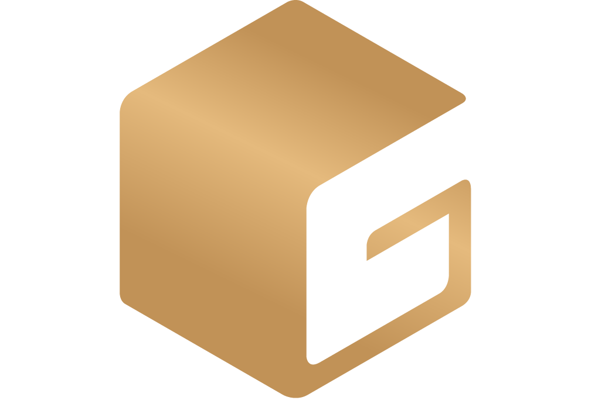

---

# Golden Cube — Interior Studio

**Website:** `https://sample-website-url.com` (replace with your live URL)(I have not deployed Website from my end)
**Logo:** 

---

## Overview

**Golden Cube** is a luxury interior design studio focused on creating timeless and elegant living spaces. Our website presents our design philosophy, portfolio, services, and ways for clients to get in touch.

The website emphasizes:

* Luxury and elegance with a modern aesthetic.
* Clear, visually engaging presentation of services and portfolio.
* Interactive and responsive user experience.
* Easy access to contact via WhatsApp, Gmail, or phone.

---

## Features

### Hero Section

* Full-screen background slider with high-resolution images.
* Animated entrance for logo, heading, subheading, and call-to-action buttons.
* Luxury design theme with gold accents and text shadows.

### About Section

* Informative description of the studio, mission, and design philosophy.
* Alternating grid layout with images and text.
* Smooth fade-in animations for visual engagement.

### Services Section

* Grid layout showcasing all services.
* Animated cards with hover effects for luxury feel.
* Icons representing each service for quick recognition.

### Portfolio/Gallery

* Responsive grid layout for project images.
* Hover effects with scaling and lightbox for detailed view.
* Works well on desktop and mobile devices.

### Testimonials

* Horizontally scrollable testimonial cards.
* Fade-in animations for dynamic engagement.
* Responsive layout ensures readability on all screen sizes.

### Contact

* Easy-to-use contact form styled for clarity.
* Direct links for WhatsApp, Gmail, and phone calls.
* Provides multiple options for reaching the studio.

### Navigation

* Responsive navigation bar with hamburger menu for mobile.
* Smooth scrolling to sections.
* Social icons with hover effects and accessible labels.

### Back to Top Button

* Floating button for quick scroll-to-top functionality.
* Subtle animation and hover effect for interaction.

### Footer

* Minimalist footer with brand name and contact links.
* Hover effects for interactive engagement.

---

## Technologies Used

* **HTML5** — Semantic structure of the website.
* **CSS3** — Styling, layout, animations, and responsive design.
* **Google Fonts** — `Manrope` for body text, `Luxia` for headings.
* **Custom Fonts** — `Metropolis` and `Luxia` for typography.
* **Responsive Design** — Mobile-first layout with media queries.
* **SVG Icons** — Scalable and interactive icons for social links and services.

---

## Installation / Deployment

1. **Clone the repository:**

   ```bash
   git clone https://github.com/khushalsarode/golden-cube-website.git
   ```

2. **Navigate to the project folder:**

   ```bash
   cd golden-cube-website
   ```

3. **Open `index.html` in your browser** or deploy using any static site hosting service Like:

   * [GitHub Pages](https://pages.github.com/)
   * [Netlify](https://www.netlify.com/)
   * [Vercel](https://vercel.com/)

---

## Folder Structure

```
golden-cube-website/
│
├── index.html          # Main website HTML file
├── golden_cube_actual.png # Logo
├── fonts/              # Custom font files
├── css/ (optional)     # If separated from inline styles
└── golden_club_gallery/             # Project/gallery images
```

---

## Notes

* Designed for modern browsers (Chrome, Firefox, Edge, Safari).
* Fully responsive for desktop, tablet, and mobile.
* Smooth animations and interactive hover effects for better UX.
* All icons and fonts are optimized for web performance.

---
