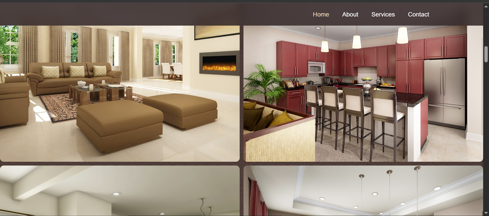
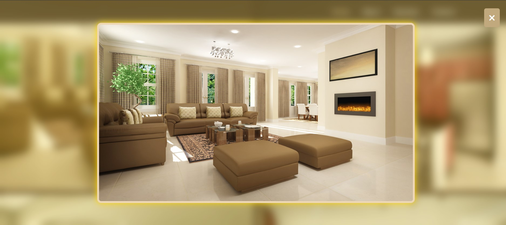

# 🌟 Golden Cube – Design Studio Website

Golden Cube is a premium design studio website that showcases luxurious and innovative interior, architectural, and digital design services. Built with elegant visuals, smooth transitions, and a golden-themed aesthetic, the site aims to impress and engage high-end clientele.

---

## 📸 Demo Screenshots

### 🖼️ Image Gallery – Full Grid Layout


### ✨ Overlay Modal with Golden Blur Background


---

## 🚀 Features

- 🎨 **Modern Hero Section** with animated text and call-to-action buttons.
- 🖼️ **Interactive Image Gallery** with smooth scroll-in animations and modal viewer.
- 🌐 **Fully Responsive Layout** – optimized for mobile, tablet, and desktop.
- 💬 **Integrated Chatbot** with scrollable chat window and easy deployment.
- 📦 **Modular Components**: Well-structured and reusable HTML/CSS/JS.
- 🏗️ **Sections Included**:
  - Home
  - Introduction
  - About (Projects)
  - Gallery
  - Services
  - Testimonials
  - Contact
  - Footer

---

## 🔧 Tech Stack

- **HTML5**
- **CSS3**
- **JavaScript**
- **Boxicons** – for modern icons
- **Particles.js** – animated background effect
- **Scroll animations** – fade-in and slide effects
- **Custom modal system** – for image previews
- **Chatbot integration** – using simple HTML/CSS/JS

---

## 📁 Folder Structure

```

project/
│
├── golden\_cube\_gallery/         # All project images
├── screenshots/                 # Preview screenshots
├── index.html                   # Main website file
├── style.css                    # Custom styles
├── script.js                    # Interactivity and animations
└── README.md                    # Project documentation

````

---

## 🛠️ Setup Instructions

1. **Clone the repository** or download the source code.
   ```bash
   git clone https://github.com/yourusername/golden-cube.git
````

2. **Open `index.html`** in your preferred browser.

3. **Ensure the folder structure is intact**, especially for:

   * `/golden_cube_gallery/` → images
   * `/screenshots/` → preview images (for README/demo)


---

## ✨ Customization Tips

* **Logo**: Replace the demo logo in the header section with your own:

  ```html
  
  ```

* **Social Media Links**: Update the `<a>` tags in the contact section to point to your real profiles.

* **Image Modal Logic**: JS is already set up to allow forward/back navigation and a close button.

---

